# 📖 Documentation — Linux Active Directory With Samba

> **Author:** Miguel Pérez Ibáñez  
> **Repository:** https://github.com/checkers23/Linux-Active-Directory

---

## Table of Contents

1. [Server Preparation — Disks](#1-server-preparation--disks)
2. [Network and Hostname — srv01](#2-network-and-hostname--srv01)
3. [Samba AD DC — Installation and Provisioning](#3-samba-ad-dc--installation-and-provisioning)
4. [Domain and Kerberos Verification](#4-domain-and-kerberos-verification)
5. [Domain Users and Groups](#5-domain-users-and-groups)
6. [Shared Folders with Permissions](#6-shared-folders-with-permissions)
7. [Linux Client — uc01](#7-linux-client--uc01)
8. [AWS Server — bespin07](#8-aws-server--bespin07)
9. [SSH Access and Process Control](#9-ssh-access-and-process-control)
10. [Scheduled Task with Cron](#10-scheduled-task-with-cron)
11. [Trust Relationship Between Domains](#11-trust-relationship-between-domains)

---

## 1. Server Preparation — Disks

The first step was setting up the virtual machine in VirtualBox with two separate disks. This is a requirement from the project — one disk handles the operating system and the other is dedicated exclusively to user home directories, which is a common practice in production environments to isolate user data from the system.

The VM was configured with a 20 GB disk for the root filesystem `/` and a 10 GB disk for `/home`. During the Ubuntu Server 22.04 installation, the **Custom storage layout** option was selected to manually assign each disk to its respective mount point.

After the system booted, the disk layout was verified with the following commands to confirm both disks were correctly mounted:

```bash
lsblk
```

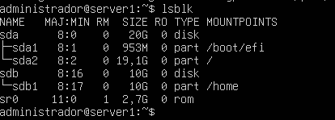

---

## 2. Network and Hostname — srv01

### Setting the Hostname

Before configuring anything else, the server hostname was set to match the domain structure. This is critical because Samba uses the hostname to register DNS records and build the Kerberos configuration — if the hostname is wrong, the whole domain setup will fail.

```bash
sudo hostnamectl set-hostname srv01.deathstar.local
hostname -f
```

### Editing /etc/hosts

The `/etc/hosts` file was edited to map the server's static IP to its fully qualified domain name. This ensures that even before Samba's DNS is running, the system can resolve its own name correctly. Any existing line with `127.0.1.1` pointing to the old hostname was removed, as it would conflict with Kerberos authentication.

```bash
sudo nano /etc/hosts
```

```
127.0.0.1       localhost
192.168.1.1     srv01.deathstar.local srv01
```

> **Note:** During initial setup the IP was mistakenly set to `192.168.10.1` and was later corrected to `192.168.1.1`.

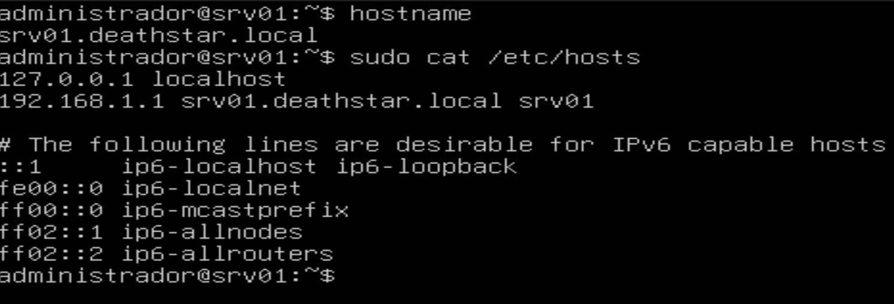

### Configuring Network Interfaces

The server has two network adapters: `enp0s3` connected to NAT for internet access, and `enp0s8` configured with a static IP on the internal network so domain clients can reach it. Netplan was used to set this up:

```bash
sudo nano /etc/netplan/00-installer-config.yaml
```

```yaml
network:
  version: 2
  ethernets:
    enp0s3:
      dhcp4: yes
    enp0s8:
      dhcp4: no
      addresses:
        - 192.168.1.1/24
      nameservers:
        addresses:
          - 127.0.0.1
          - 8.8.8.8
        search:
          - deathstar.local
```

The nameserver is set to `127.0.0.1` because once Samba is running, it will act as the DNS server itself. Google's DNS (`8.8.8.8`) is kept as a fallback for internet resolution.

```bash
sudo netplan apply
```

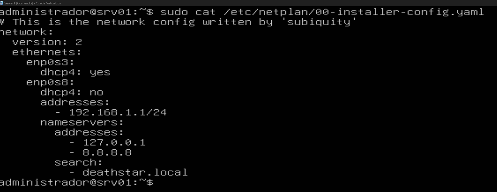

### Disabling systemd-resolved

Ubuntu uses `systemd-resolved` by default which listens on port 53 and would conflict with Samba's internal DNS server. It was stopped and disabled, and `/etc/resolv.conf` was replaced with a static file pointing to localhost:

```bash
sudo systemctl stop systemd-resolved
sudo systemctl disable systemd-resolved
sudo unlink /etc/resolv.conf
sudo nano /etc/resolv.conf
```

```
nameserver 127.0.0.1
nameserver 8.8.8.8
search deathstar.local
```

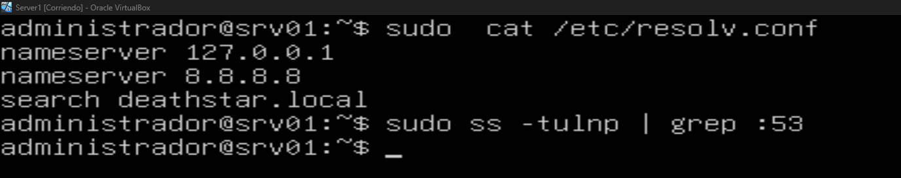

---

## 3. Samba AD DC — Installation and Provisioning

### Installing the Packages

The Samba packages were installed before running the domain provisioning. This order is critical — if provisioning is run first and the `samba-ad-dc` package is installed afterwards, the domain configuration will be incomplete and Kerberos will not work.

```bash
sudo apt install -y samba samba-ad-dc krb5-user samba-dsdb-modules samba-vfs-modules winbind
```

During installation, a dialog appeared asking for the default Kerberos realm. `DEATHSTAR.LOCAL` was entered in uppercase, which is required by Kerberos.

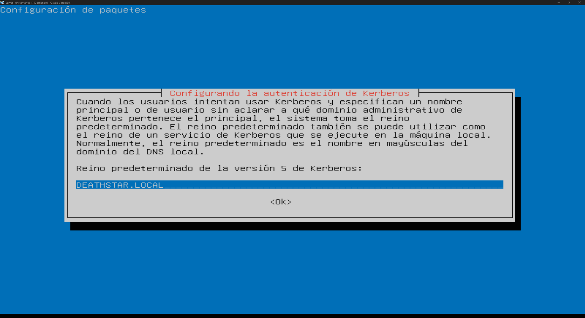

### Cleaning Up Before Provisioning

Before provisioning the domain, the default Samba services were stopped and disabled to avoid conflicts with `samba-ad-dc`. The default configuration files were also backed up since the provisioning process generates new ones:

```bash
sudo systemctl stop smbd nmbd winbind 2>/dev/null || true
sudo systemctl disable smbd nmbd winbind 2>/dev/null || true
sudo mv /etc/samba/smb.conf /etc/samba/smb.conf.orig
sudo mv /etc/krb5.conf /etc/krb5.conf.bak
```

### Provisioning the Domain

The domain was provisioned using `samba-tool`. This single command sets up the entire Active Directory structure including DNS zones, Kerberos configuration, LDAP directory, and Sysvol:

```bash
sudo samba-tool domain provision \
  --use-rfc2307 \
  --realm=DEATHSTAR.LOCAL \
  --domain=DEATHSTAR \
  --adminpass='Admin_21' \
  --server-role=dc \
  --dns-backend=SAMBA_INTERNAL
```

The `--use-rfc2307` flag enables POSIX attributes like UID and GID which are needed for Linux clients. `SAMBA_INTERNAL` was chosen as the DNS backend so Samba handles all DNS resolution internally without needing BIND.

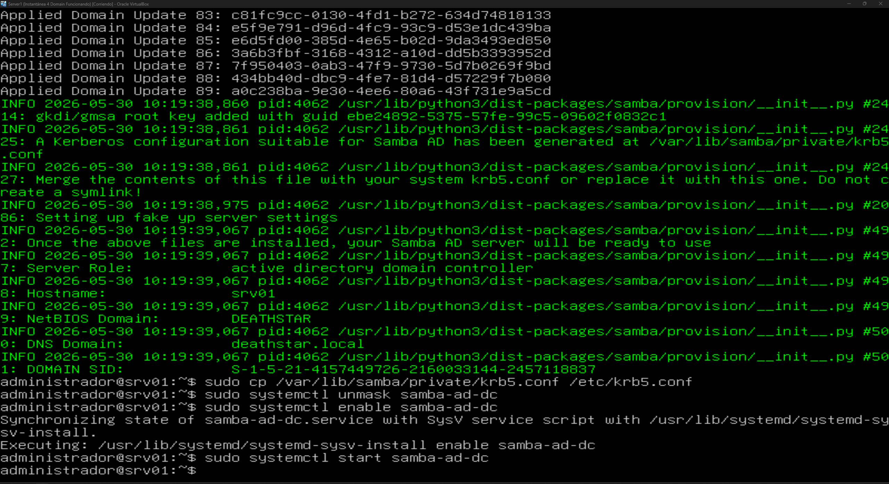

### Starting the Service

After provisioning, the Kerberos configuration generated by Samba was copied to the system location, and the service was enabled and started:

```bash
sudo cp /var/lib/samba/private/krb5.conf /etc/krb5.conf
sudo systemctl unmask samba-ad-dc
sudo systemctl enable --now samba-ad-dc
sudo systemctl status samba-ad-dc
```

The resulting `smb.conf` was verified to confirm the domain was correctly configured:

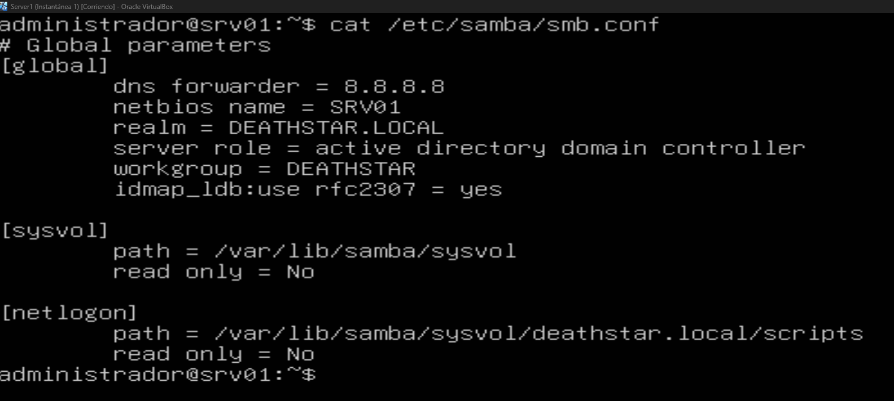

---

## 4. Domain and Kerberos Verification

Once Samba was running, a series of checks were performed to confirm the domain was working correctly. The DNS records were verified to ensure clients would be able to discover the domain controller:

```bash
sudo samba-tool domain level show
sudo samba-tool domain info 127.0.0.1
host -t A srv01.deathstar.local
host -t SRV _ldap._tcp.deathstar.local
host -t SRV _kerberos._tcp.deathstar.local
```

A duplicate DNS entry for the NAT interface IP (`10.0.2.15`) was discovered and removed. This duplicate caused Kerberos to fail because it received a response from the wrong IP. It was cleaned up with:

```bash
sudo samba-tool dns delete 127.0.0.1 deathstar.local srv01 A 10.0.2.15 -U Administrator
```

Finally, a Kerberos ticket was requested to confirm the authentication system was working end to end. The realm must always be written in uppercase — using lowercase causes the `KDC reply did not match expectations` error:

```bash
kinit Administrator@DEATHSTAR.LOCAL
klist
```

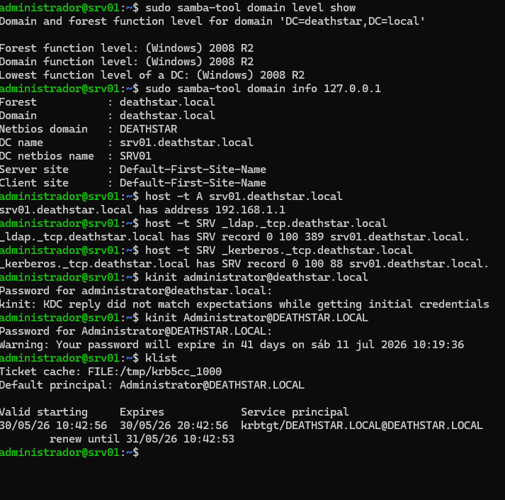

---

## 5. Domain Users and Groups

Three domain users were created for the shared folder permissions: `leia`, `anakin`, and `yoda`. A security group called `jedis` was also created and `anakin` and `yoda` were added to it. This group membership is later used to control access to the `force` shared folder:

```bash
sudo samba-tool user create leia Admin_21
sudo samba-tool user create anakin Admin_21
sudo samba-tool user create yoda Admin_21
sudo samba-tool group add jedis
sudo samba-tool group addmembers jedis anakin,yoda
sudo samba-tool user list
sudo samba-tool group list
sudo samba-tool group listmembers jedis
```

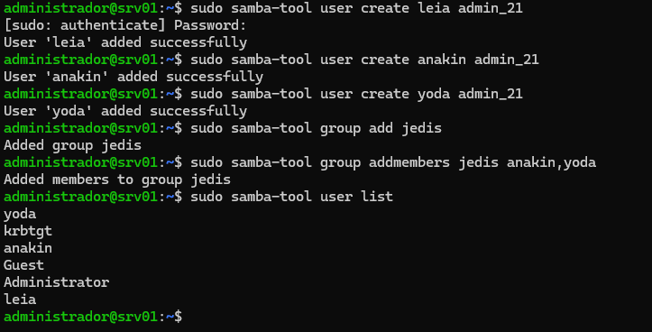

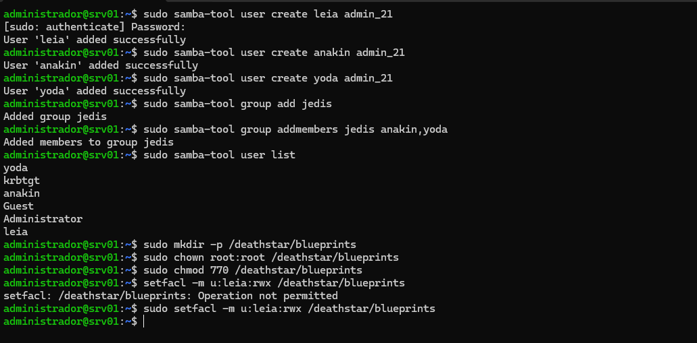

---

## 6. Shared Folders with Permissions

Three shared folders were configured with different access rules using a combination of Linux filesystem permissions and Samba share definitions.

### Creating the Directories and Setting Permissions

The directories were created and permissions were applied using `chown`, `chmod`, and ACLs via `setfacl`. ACLs allow fine-grained per-user permissions on top of standard Linux permissions, which is necessary to block specific users while allowing others:

```bash
sudo mkdir -p /deathstar/blueprints
sudo mkdir -p /sw/family
sudo mkdir -p /sw/force

# blueprints — private, leia only
sudo chown root:root /deathstar/blueprints
sudo chmod 770 /deathstar/blueprints
sudo setfacl -m u:leia:rwx /deathstar/blueprints

# family — public, anakin denied
sudo chown root:"Domain Users" /sw/family
sudo chmod 775 /sw/family
sudo setfacl -m u:anakin:--- /sw/family

# force — public, read-only, leia denied
sudo chown root:"Domain Users" /sw/force
sudo chmod 775 /sw/force
sudo setfacl -m u:anakin:r-x /sw/force
sudo setfacl -m u:yoda:r-x /sw/force
sudo setfacl -m g:jedis:r-x /sw/force
sudo setfacl -m u:leia:--- /sw/force
```

### Configuring the Samba Shares

The `/etc/samba/smb.conf` file was edited to define the three shares with their access rules. `blueprints` has `browseable = no` so it does not appear in network browsing — users must know the exact path to access it. `family` and `force` are public and browseable:

```ini
[blueprints]
    path = /deathstar/blueprints
    browseable = no
    read only = no
    valid users = DEATHSTAR\leia

[family]
    path = /sw/family
    browseable = yes
    read only = no
    invalid users = DEATHSTAR\anakin
    guest ok = yes

[force]
    path = /sw/force
    browseable = yes
    read only = yes
    valid users = DEATHSTAR\anakin DEATHSTAR\yoda @DEATHSTAR\jedis
    invalid users = DEATHSTAR\leia
    guest ok = yes
```

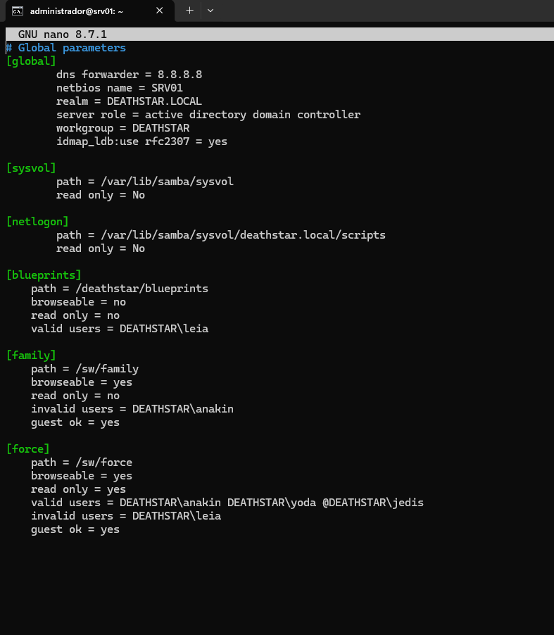


### Verifying Access

After restarting Samba, each user's access was tested using `smbclient`. The results confirmed that all permissions were correctly applied:

```bash
sudo systemctl restart samba-ad-dc

smbclient //localhost/blueprints -U leia%admin_21    # ✅ leia connects
smbclient //localhost/blueprints -U anakin%admin_21  # ❌ anakin denied
smbclient //localhost/family -U anakin%admin_21      # ❌ anakin denied
smbclient //localhost/family -U leia%admin_21        # ✅ leia connects
smbclient //localhost/force -U leia%admin_21         # ❌ leia denied
smbclient //localhost/force -U anakin%admin_21      # ✅ anakin connects
smbclient //localhost/force -U yoda%admin_21         # ✅ yoda connects
```

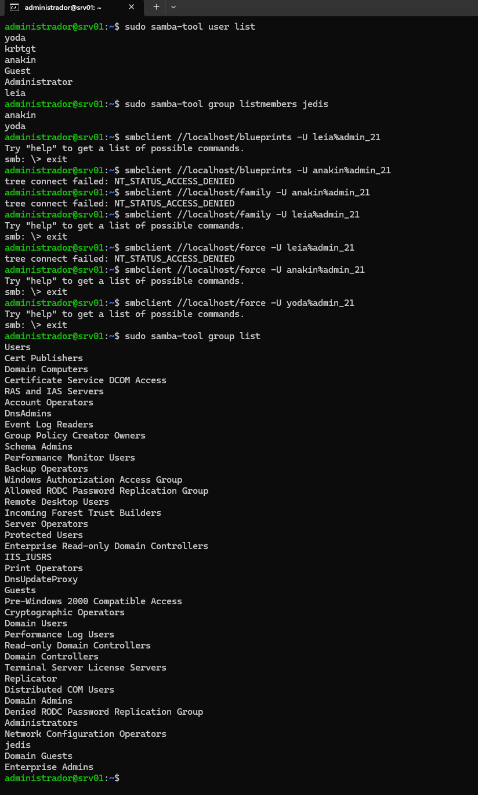

---

## 7. Linux Client — uc01

### Configuring the Network

The Ubuntu 24.04 desktop client uses NetworkManager instead of Netplan, so the network was configured through the graphical Settings interface. The static IP `192.168.1.3` was assigned, with `192.168.1.1` set as the DNS server so the client can resolve the domain controller:

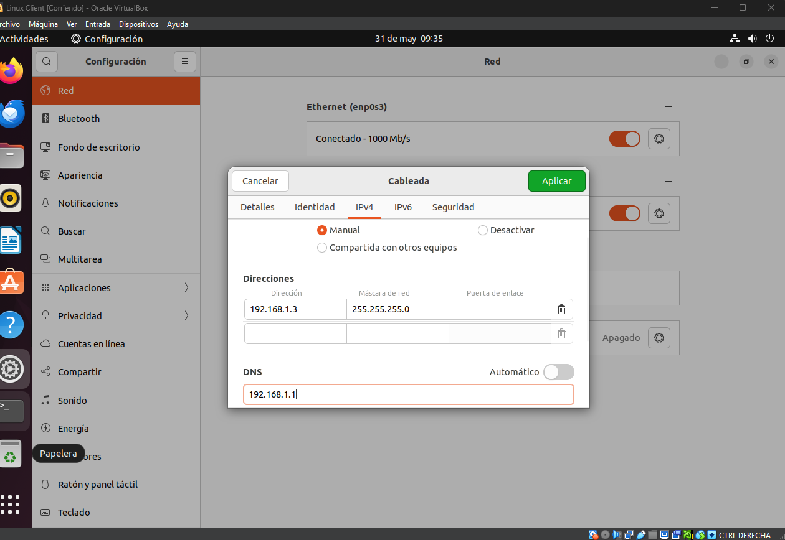

Since NetworkManager sometimes overwrites `/etc/resolv.conf`, it was also manually edited to ensure DNS resolution worked immediately:

```bash
sudo nano /etc/resolv.conf
```

```
nameserver 192.168.1.1
search deathstar.local
```

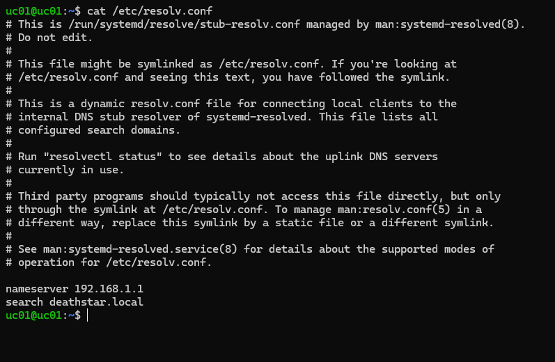

### Installing Required Packages

The packages needed to join an Active Directory domain were installed. `realmd` handles the domain join process, `sssd` manages authentication and identity lookups, and `adcli` is the low-level tool that communicates with the domain controller:

```bash
sudo apt install -y realmd sssd sssd-tools adcli samba-common-bin packagekit
```

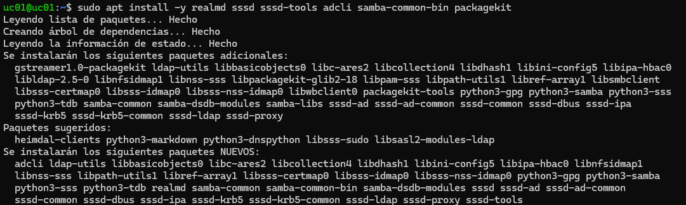

### Discovering and Joining the Domain

Before joining, the domain was discovered to confirm the client could see the domain controller:

```bash
realm discover DEATHSTAR.LOCAL
```

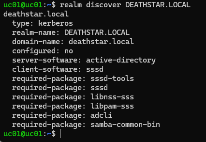

The client was then joined to the domain. After the join, `realm list` confirmed the client was configured as a `kerberos-member`, and `id` confirmed that domain users were recognized with proper UIDs:

```bash
sudo realm join DEATHSTAR.LOCAL -U Administrator
realm list
id leia@DEATHSTAR.LOCAL
id anakin@DEATHSTAR.LOCAL
```

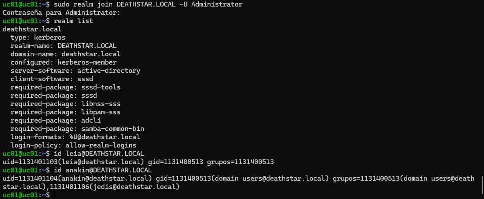

### SSSD Configuration

The `use_fully_qualified_names` setting in `sssd.conf` was set to `False` so users can log in as `leia` instead of having to type `leia@DEATHSTAR.LOCAL`. The `mkhomedir` PAM module was enabled so a home directory is automatically created on first login:

```bash
sudo systemctl restart sssd
sudo pam-auth-update --enable mkhomedir
```

### Testing Domain Users

Kerberos tickets were requested for each domain user to confirm authentication worked from the client:

```bash
kinit leia@DEATHSTAR.LOCAL
kinit anakin@DEATHSTAR.LOCAL
kinit yoda@DEATHSTAR.LOCAL
```

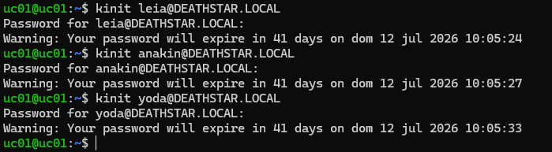

### Graphical Login with Domain Account

The final test was logging into the desktop graphically with a domain account. The session was closed and `leia@DEATHSTAR.LOCAL` was entered at the login screen with password `Admin_21`. After logging in, the terminal confirmed the identity:

```bash
whoami   # leia@deathstar.local
hostname # uc01
```
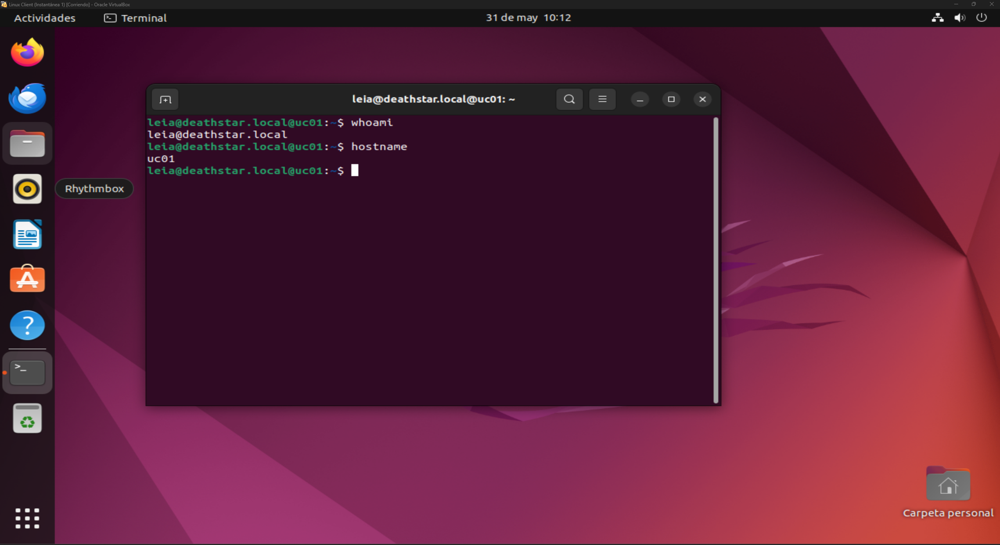


---

## 8. AWS Server — bespin07

### Setting Up the Infrastructure in AWS Academy

A dedicated virtual network was created in AWS to host the bespin07 server. A VPC with CIDR `10.0.0.0/16` was created with one public subnet, an internet gateway, and DNS enabled. This gives the EC2 instance both a private internal IP and a reachable public IP:

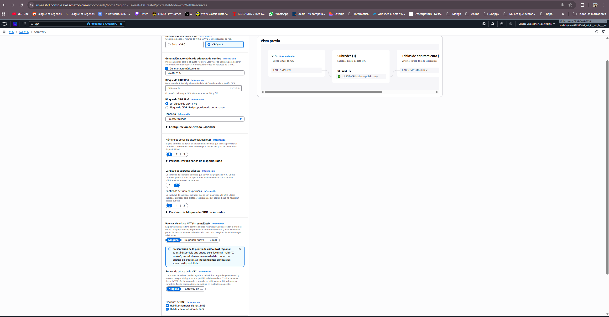

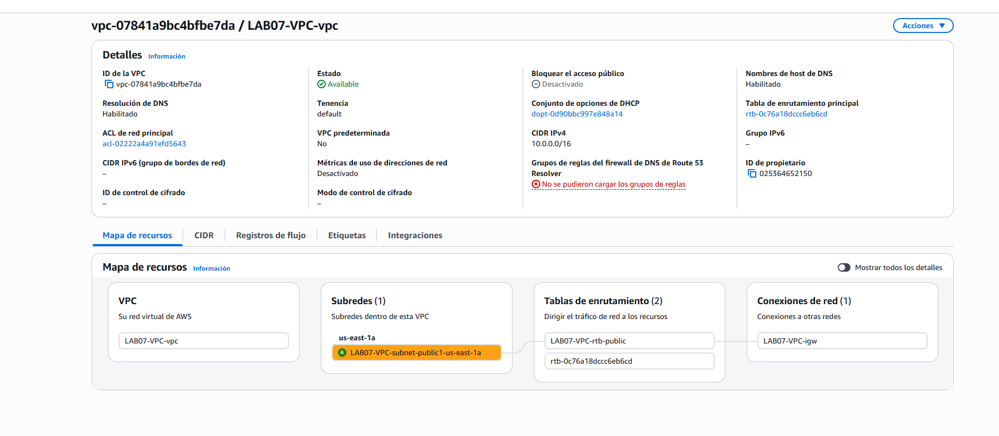

Auto-assign public IPv4 was enabled on the subnet so EC2 instances receive a public IP automatically on launch:

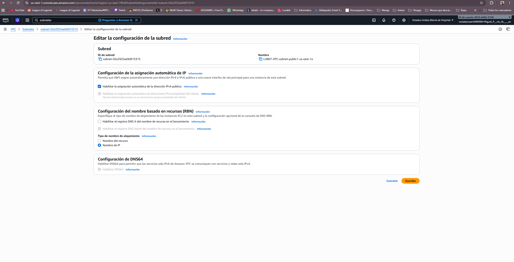

A security group called `LAB07-SG` was created with all the ports required for Active Directory. Each rule was carefully chosen to allow only the necessary traffic for the domain to function:

| Type | Protocol | Port | Source | Purpose |
|------|----------|------|--------|---------|
| SSH | TCP | 22 | 0.0.0.0/0 | Remote administration from any IP |
| DNS (TCP) | TCP | 53 | 10.0.0.0/20 | DNS queries within the VPC |
| DNS (UDP) | UDP | 53 | 10.0.0.0/20 | DNS queries within the VPC |
| Custom TCP | TCP | 88 | 10.0.0.0/20 | Kerberos authentication |
| Custom UDP | UDP | 88 | 10.0.0.0/20 | Kerberos authentication |
| LDAP | TCP | 389 | 10.0.0.0/20 | Active Directory directory queries |
| SMB | TCP | 445 | 10.0.0.0/20 | File sharing and domain communication |
| Custom TCP | TCP | 636 | 10.0.0.0/20 | LDAPS — encrypted LDAP |
| Custom TCP | TCP | 3268 | 10.0.0.0/20 | Global Catalog queries |
| Custom TCP | TCP | 3269 | 10.0.0.0/20 | Global Catalog over SSL |
| RDP | TCP | 3389 | 0.0.0.0/0 | Remote desktop access |
| All traffic | All | All | 10.0.0.0/20 | Internal VPC communication |

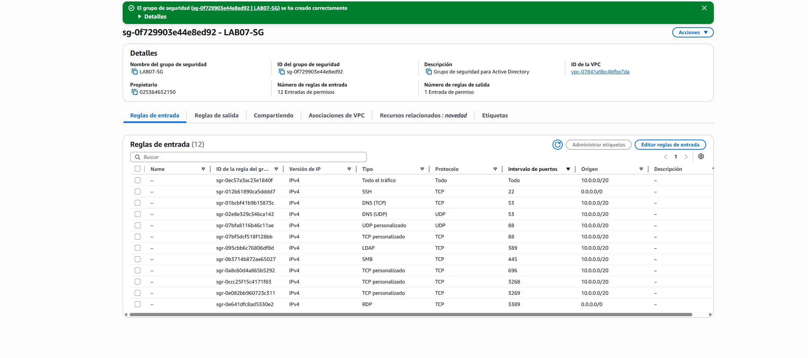

### Connecting via SSH from Windows

An EC2 instance named `Bespin07` was launched with Ubuntu Server 24.04, type `t3.small`, static private IP `10.0.1.10`, and an Elastic IP `100.55.166.123` assigned for stable public access. An Elastic IP is necessary because EC2 instances get a new public IP every time they restart — by associating a fixed Elastic IP, the server is always reachable at the same address regardless of restarts.

To connect from Windows, the PEM key file was first downloaded from the AWS Academy interface. In the lab page, clicking **AWS Details** and then **Download PEM** gives you the `labsuser.pem` file which contains the private key for the `vockey` key pair used when launching the instance.

Before using the key, Windows requires the file permissions to be restricted — SSH will refuse to use a key file that is readable by other users. The following commands were run in CMD to fix the permissions:

```
icacls C:\labsuser.pem /inheritance:r
icacls C:\labsuser.pem /remove "BUILTIN\Usuarios"
icacls C:\labsuser.pem /remove "NT AUTHORITY\Usuarios autentificados"
icacls C:\labsuser.pem /grant:r "migue:R"
ssh -i C:\labsuser.pem ubuntu@100.55.166.123
```

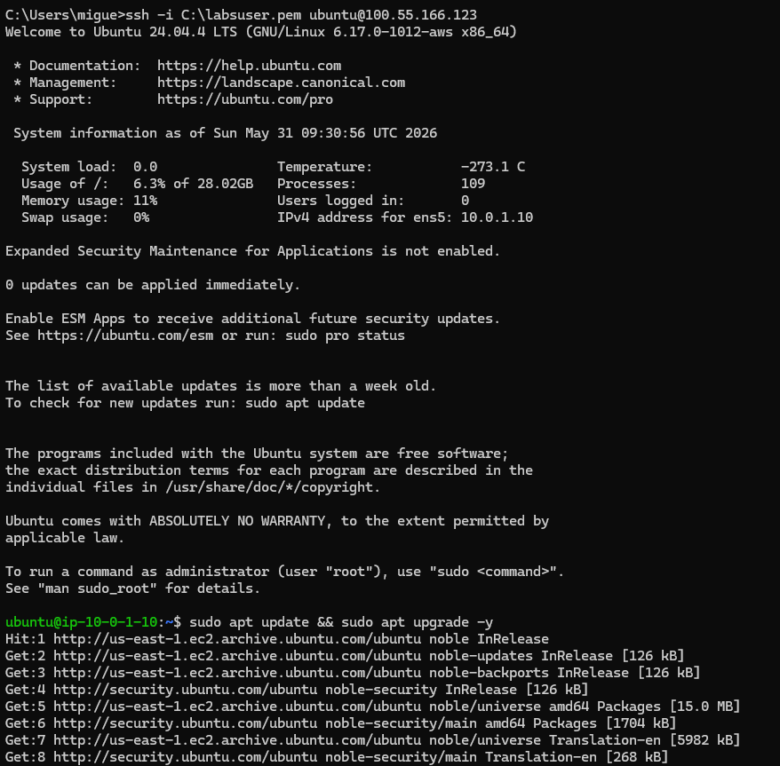

### Configuring the Server

Once connected, the hostname was set and `/etc/hosts` was configured, following the same process as srv01. The server's private IP `10.0.1.10` was mapped to its FQDN `bespin07.cloud07.city`:

```bash
sudo hostnamectl set-hostname bespin07.cloud07.city
sudo nano /etc/hosts
# 10.0.1.10   bespin07.cloud07.city bespin07
```

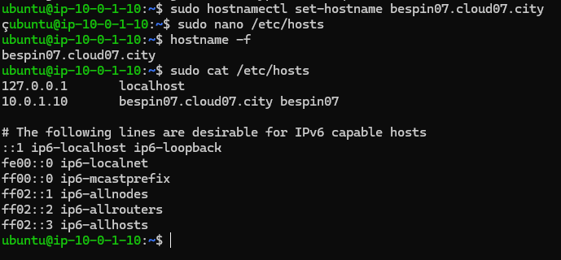

### Installing Samba and Provisioning the Domain

The same installation and provisioning process was followed as for srv01, but this time for the `CLOUD07.CITY` domain:

```bash
sudo apt install -y samba samba-ad-dc krb5-user samba-dsdb-modules samba-vfs-modules winbind

sudo systemctl stop smbd nmbd winbind 2>/dev/null || true
sudo mv /etc/samba/smb.conf /etc/samba/smb.conf.orig
sudo mv /etc/krb5.conf /etc/krb5.conf.bak

sudo samba-tool domain provision \
  --use-rfc2307 \
  --realm=CLOUD07.CITY \
  --domain=CLOUD07 \
  --adminpass='Admin_21' \
  --server-role=dc \
  --dns-backend=SAMBA_INTERNAL
```

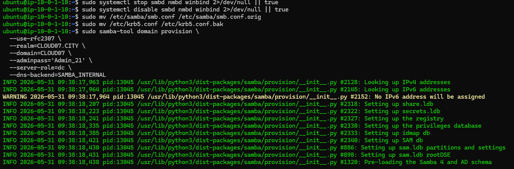

The Kerberos config was copied and the service was started:

```bash
sudo cp /var/lib/samba/private/krb5.conf /etc/krb5.conf
sudo systemctl unmask samba-ad-dc
sudo systemctl enable --now samba-ad-dc
sudo systemctl status samba-ad-dc
```

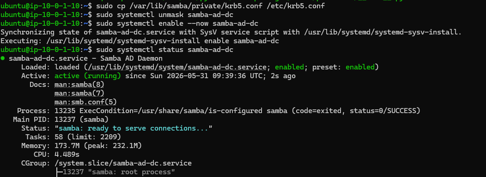

The DNS was verified and a Kerberos ticket was obtained to confirm everything was working:

```bash
host -t A bespin07.cloud07.city 127.0.0.1
kinit Administrator@CLOUD07.CITY
klist
```

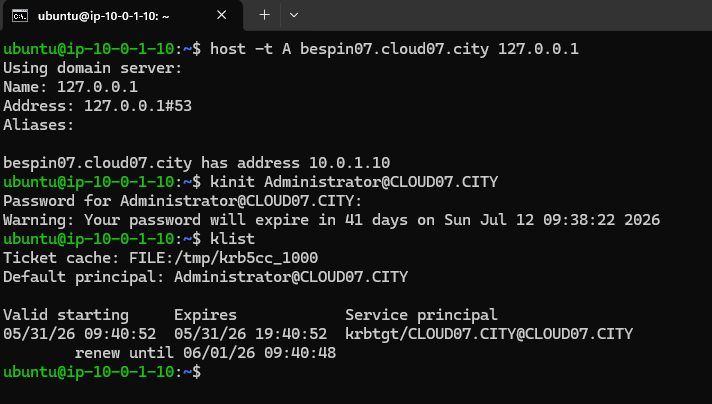

### Creating Users and the Trap Share

Two users were created: `lando` who is allowed to access the `trap` share, and `boba` who is explicitly denied:

```bash
sudo samba-tool user create lando Admin_21
sudo samba-tool user create boba Admin_21
sudo samba-tool user list
```

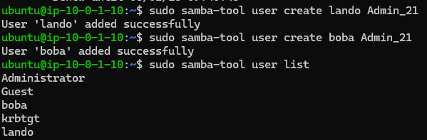

The `/city/trap` directory was created with a subdirectory `MPI` (author's initials as required by the project). Ownership and permissions were set, and the share was configured in `smb.conf`:

```bash
sudo mkdir -p /city/trap/MPI
sudo chown root:"Domain Users" /city/trap
sudo chmod 770 /city/trap
```

```ini
[trap]
    path = /city/trap
    browseable = no
    read only = no
    valid users = CLOUD07\lando
    invalid users = CLOUD07\boba
```

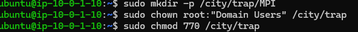

Access was verified — lando connects successfully while boba is denied:

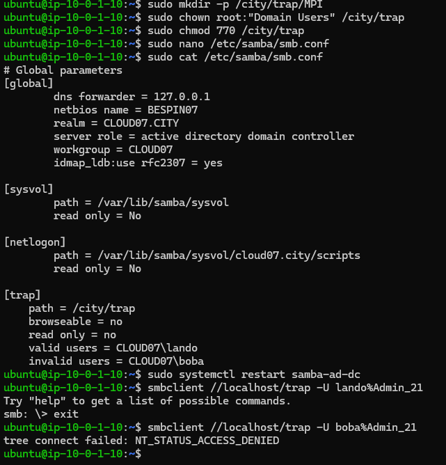

---

## 9. SSH Access and Process Control

SSH access to srv01 from the physical machine was configured using VirtualBox port forwarding (host port 2222 → guest port 22). This allows managing the server remotely without needing a separate network interface.

The `sl` package (Steam Locomotive) was installed to demonstrate POSIX process signals. When launched, it displays an animated train in the terminal. Using a second SSH session, the process was paused with `SIGSTOP` (signal 19) and then resumed with `SIGCONT` (signal 18):

```bash
# Terminal 1 — start the train
sl

# Terminal 2 — find and stop the process
kill -19 $(pgrep -x sl)
```

![sl train frozen mid-animation — [1]+ Stopped sl shown in terminal](Images/images-011_Sl_Stop.png)

```bash
# Terminal 2 — resume the process
kill -18 $(pgrep -x sl)
```

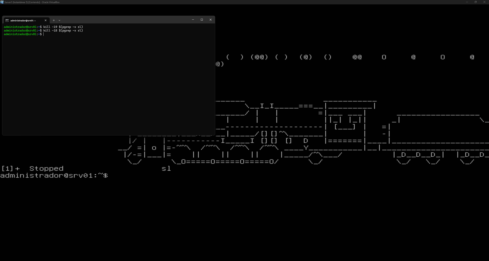

---

## 10. Scheduled Task with Cron

A script called `r2d2.sh` was created to automate the creation of a file called `luke.sky`. The script also writes a timestamped entry to a log file each time it runs, so execution can be verified:

```bash
sudo nano /usr/local/bin/r2d2.sh
```

```bash
#!/bin/bash
touch /home/administrador/luke.sky
echo "luke.sky created on $(date)" >> /var/log/r2d2.log
```

```bash
sudo chmod +x /usr/local/bin/r2d2.sh
```

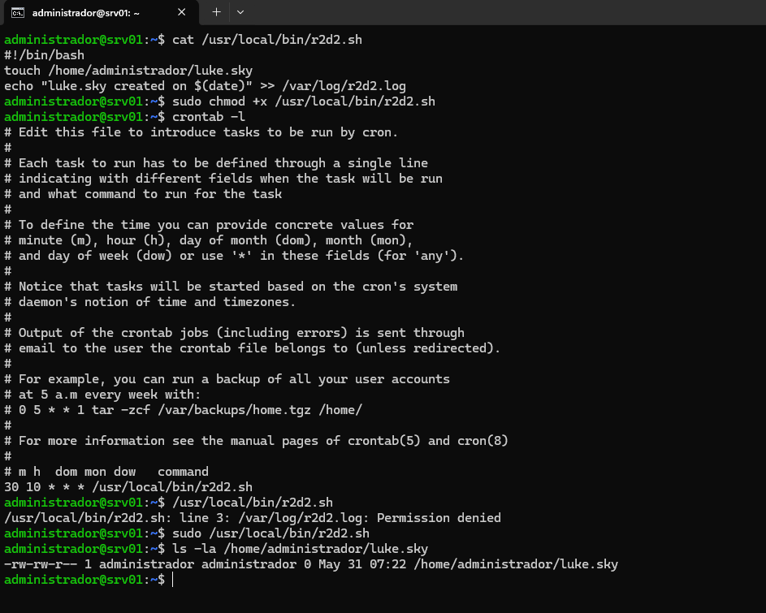

The script was added to the crontab to run automatically every day at 10:30. Cron uses the format `minute hour day month weekday command`:

```bash
crontab -e
# Added: 30 10 * * * /usr/local/bin/r2d2.sh
crontab -l
```

To verify the script worked correctly before waiting for the scheduled time, it was run manually:

```bash
sudo /usr/local/bin/r2d2.sh
ls -la /home/administrador/luke.sky
```

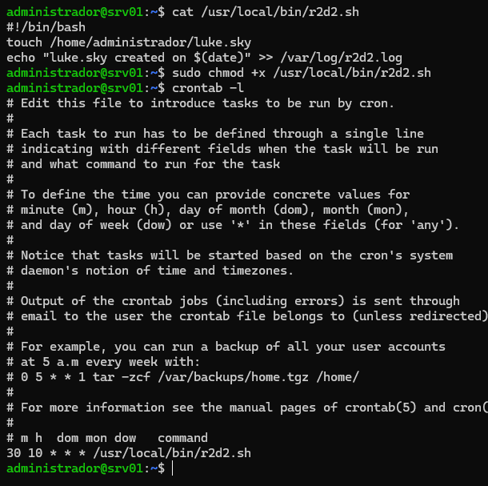

---

## 11. Trust Relationship Between Domains

A bidirectional trust relationship was established between `deathstar.local` (srv01, `192.168.1.1`) and `lab07.lan` (ls07, `192.168.1.2`). This allows users from either domain to authenticate against resources in the other domain.

### Configuring DNS Forwarding

For the trust to work, each domain controller needs to be able to resolve the other domain's DNS records. DNS forwarders were added to each server's `smb.conf` so queries for the other domain are forwarded to the correct DC:

On srv01, `dns forwarder` was set to forward to ls07:

```ini
dns forwarder = 192.168.1.2 8.8.8.8
```

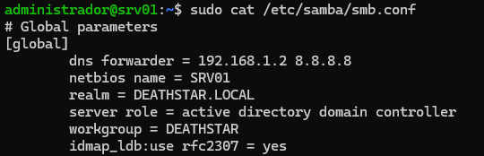

On ls07, `dns forwarder` was set to forward to srv01:

```ini
dns forwarder = 192.168.1.1 8.8.8.8
```

.png)

After restarting Samba on both servers, cross-domain DNS resolution was verified before attempting the trust creation.

### Creating the Trust

The trust was created from srv01 using `samba-tool`. The `--type=external` and `--direction=both` flags create a bidirectional external trust, meaning both domains trust each other equally:

```bash
sudo samba-tool domain trust create LAB07.LAN \
  --type=external \
  --direction=both \
  -U Administrator
```

The output confirmed that both the outgoing and incoming trust were validated successfully with `TRUST[WERR_OK]`:

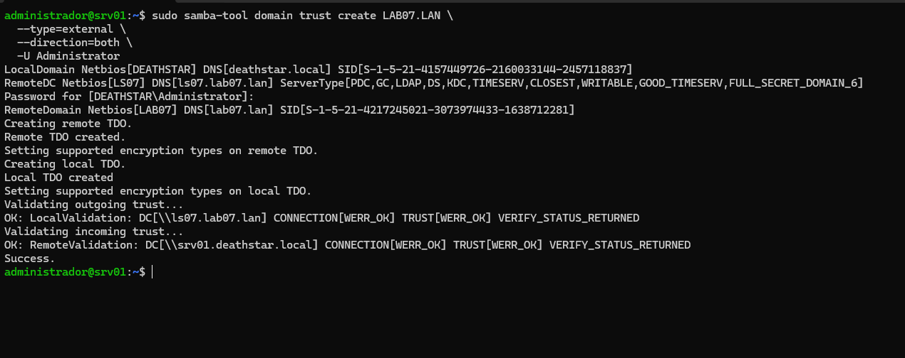

### Verifying the Trust

The trust was verified from srv01 by listing active trusts and running a cross-domain Kerberos authentication. Successfully obtaining a Kerberos ticket for `Administrator@LAB07.LAN` from srv01 is the definitive proof that the trust is working:

```bash
sudo samba-tool domain trust list
sudo samba-tool domain trust validate LAB07.LAN -U Administrator
kinit Administrator@LAB07.LAN
klist
```

> **Note:** The `NETLOGON_CONTROL_TC_VERIFY` error occurs because during remote validation, srv01 asks ls07 to verify the trust connection from its own side using the `NetrLogonControl2Ex` command. This command is not fully implemented in Samba 4, so ls07 responds with `WERR_ACCESS_DENIED` instead of executing it. This is a known Samba 4 limitation and does not mean the trust failed — it was already validated successfully in the previous step as confirmed by `TRUST[WERR_OK]` in LocalValidation and the working cross-domain `kinit`.
![Trust list showing lab07.lan Direction[BOTH], LocalValidation WERR_OK, and kinit to LAB07.LAN returning a valid ticket](Images/images-035_Trust_Comprobaciones_srv01.png)

From ls07, the trust list was also verified to confirm the relationship is registered on both sides:

```bash
sudo samba-tool domain trust list
```

![ls07 trust list showing deathstar.local with Direction[BOTH]](Images/images-036_Trust_Comprobaciones_ls07(SERVER2).png)

---

*Documentation by MPI — DeathStar S.A. | https://github.com/checkers23/Linux-Active-Directory*
